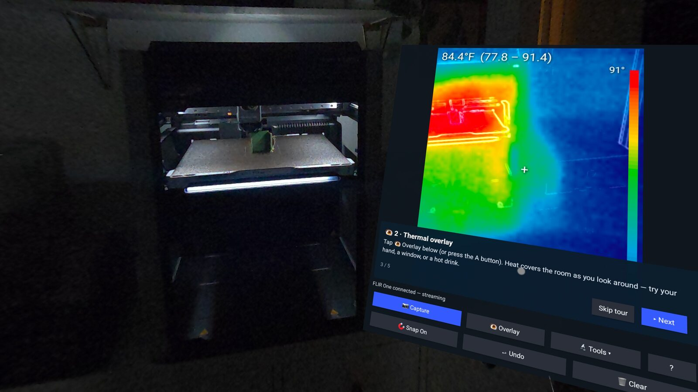

# FLIR One USB-C thermal camera toolkit

[](https://thermaspace.org/)

This is the code behind **[ThermaSpace](https://thermaspace.org/)** — plug a
FLIR One into a Quest 3/3S and see live radiometric heat overlaid on the real
world. Built by [Opportunity Hack](https://ohack.dev) and open-sourced so
everyone can benefit.

Talks to a FLIR One (Gen2/Gen3/Pro, VID `0x09CB` PID `0x1996`) over USB using the
reverse-engineered EEVblog / [flirone-v4l2](https://github.com/fnoop/flirone-v4l2) protocol.

## What you get per frame
- **Thermal**: 160×120 (Pro/Lepton 3) or 80×60 raw 16-bit radiometric data →
  per-pixel temperature in °C (Planck calibration, adjustable emissivity)
- **Visible**: JPEG from the built-in VGA camera (blendable for MSX-style output)
- **Status JSON**: battery %, charge state, shutter/FFC calibration events

**Full HTTP endpoint reference (streams, /config tuning, watch regions,
alerts, /export): [API.md](API.md)** — both apps serve a LAN-only API.

## Components
| Path | What |
|---|---|
| `flirone.py` | Python driver + CLI (`live`, `capture`, `info`) — **works on Linux hosts** |
| `quest3-spatial/` | **ThermaSpace** — Meta Spatial SDK app: passthrough heatmap overlay, world-locked captures, drawing, gallery (pictured above) |
| `quest3-app/` | Quest 3 / Android native app: on-headset viewer + MJPEG server |
| `mount/` | 3D-printable Quest 3/3S visor mounts for the FLIR One (STL + OpenSCAD) |
| `thermaspace.org/` | Static site deployed at [thermaspace.org](https://thermaspace.org/) |
| `mac_viewer.py` | Mac viewer for the Quest stream (or just open `http://<quest-ip>:8080`) |
| `probe.py` | USB descriptor dump of the device |

```bash
pip install -r requirements.txt
python flirone.py live            # OpenCV live view (Linux host)
python flirone.py capture -n 5    # save raw16 .npy + PNG + JPEG + status
python flirone.py info            # print sizes/status
```

## ⚠️ macOS cannot stream from this device (verified exhaustively here)
The FLIR One abuses USB alt-settings as start/stop commands **and declares its
bulk endpoints only in alt 0 while streaming in alt 1**. Linux/Android don't
re-validate, so the flirone-v4l2 trick works there. macOS (IOUSBHostFamily)
intercepts every `SET_INTERFACE` — through libusb *and* raw IOKit — and tears
down the pipes exactly when the firmware starts streaming. All bypasses tested
on 2026-07-11 (Darwin 25): disguised recipient/class encodings, wValue/wIndex
mangling, pre-cleared halts, fileio JSON channel in alt 0, raw rosebud JSON on
the iAP interface (killed by `accessoryd`'s iAP2 session). Every route ends in
kernel pipe teardown, endpoint stall, or firmware reset. Matches unresolved
[libusb#729](https://github.com/libusb/libusb/issues/729).

**Practical Mac workflow**: plug the FLIR One into the Quest 3 (or any Linux
box/RPi), run the app, view the stream on the Mac over Wi-Fi.

## Quest 3 app (`quest3-app/`)
Plain Android USB-host app (no NDK). Build with Android Studio (or
`gradle assembleDebug`), then:
```bash
adb install app/build/outputs/apk/debug/app-debug.apk
```
Enable developer mode on the Quest, sideload, plug the FLIR One into the
headset's USB-C port, accept the permission dialog. The thermal view renders
as a 2D panel; `http://<quest-ip>:8080` serves MJPEG to any browser/`mac_viewer.py`.

## Protocol cheat-sheet (config 3)
| Interface | Name | Endpoints | Role |
|---|---|---|---|
| 0 | iAP | 0x81 in / 0x02 out | Apple MFi; rosebud JSON on Linux |
| 1 | com.flir.rosebud.fileio | 0x83 in / 0x04 out | file I/O (CameraFiles.zip = calibration) |
| 2 | com.flir.rosebud.frame | 0x85 in / 0x06 out | frame stream |

Start: `SET_INTERFACE` alt→0 on intf 2, alt→0 on intf 1, alt→1 on intf 1,
alt→1 on intf 2 (wLength=2!) → bulk-read 0x85.
Frame: `EF BE 00 00` + u32 seq? + u32 frameSize + u32 thermalSize + u32 jpgSize +
u32 statusSize + u32 ? (28-byte header), then thermal / jpeg / status payloads.
Thermal layouts (by payload size): G2/Pro 40016 B = 122 rows × 164 u16
`[2 pad][80][2 pad][80]` (last 2 rows telemetry); G3 10332 B = 63 rows × 82 u16
VoSPI `[line ID][CRC][80 px]` (last 3 rows telemetry) — G3 verified on real hardware.
Status JSON always contains `ffcState` — detect calibration via `shutterState:"FFC…"` only.
Temp: `raw*4` → Planck (R1 16528.178, R2 0.012258549, B 1427.5, F 1, O −1307).
